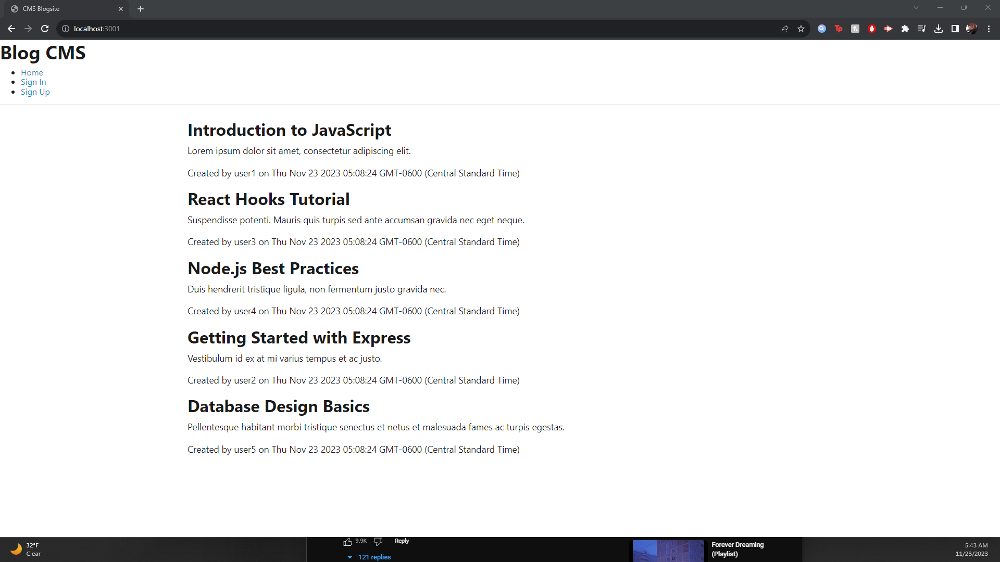

# Challenge 14 Tech Blog

## Handlebars SUCKS

I had a lot of issues with this project involving handlebars, the api routing with them and just general tech issues. Revisiting this after getting further on the course and I have realized
how much I dislike routing through controllers over using react routing.

Other than that, some successes I had were that setting up Models was super easy. Using mini proj 14 was super nice and helped me get a good start on this project.

Huge losses: Had to completely restart my project, I had messed up somewhere in the routing and just nothing was working. Restarting it all let me start again and get it right this time.

This project is LARGELY incomplete, hoping this is good enough for a 60% due to time constraints with the holidays and I just wanna bump the grade up a little bit.

Huge thanks to Andrew Mell, Wyatt Barger for helping me on this challenge.

Thank you to Tom Hearne and Matt Bronstein for teaching the class.

I hope to never see handlebars again.

